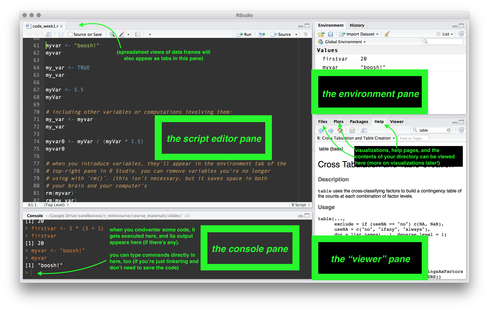
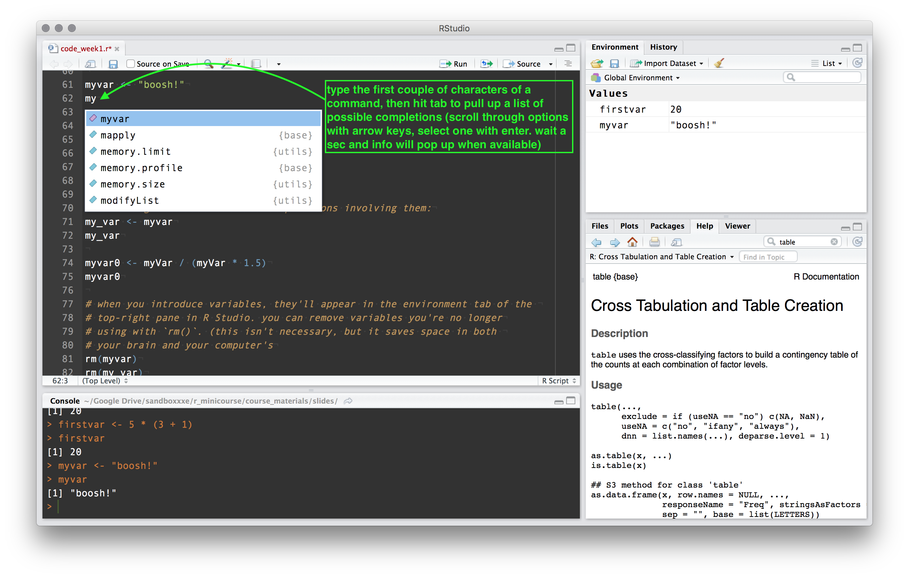

<!-- fig_width: 3 -->
<!--     fig_height: 5 -->
<!-- smaller: true -->

```{r echo=FALSE}
knitr::opts_chunk$set(echo=TRUE)
```


## welcome!

agenda for course:

- **week 1** -- R workflow, navigation, programming basics
- **week 2** -- working with datasets and external files, data cleaning + manipulation
- **week 3** -- summarizing data with `dplyr::`,  visualizing data with `ggplot2::`
- **week 4** -- document authoring with R Markdown, working with the web

course materials will eventually all be on the course website: 

> [http://lefft.xyz/r_minicourse](http://lefft.xyz/r_minicourse)


each week we'll have slides, notes, and a script. little exercises will be interleaved throughout the notes. the best way to write up solutions is to start a new R script called (e.g.) `week1_exercises.r` and type directly into that.

there will also be a list of links to useful resources up on the site


## types of files we'll be using


**R scripts**

- a plain-text file with extension `.R` or `.r`
- all plain-text files (e.g. `.txt`) can be opened and edited directly in any text editor
- contains R code that we'll run interactively in R Studio
- also contains comments, which are just annotations that explain what the code is doing

## types of files we'll be using

**datasets**

- all kinds of extensions, e.g. `.csv`, `.tsv`, `.xls`, `.xlsx`, `.dat`, `.sav`, `.dta`. nowadays, R can read them all. we'll go through examples of several in week 2.
- working with `.csv` files is generally preferable, since they are simple and come in plain-text format. 
- proprietary formats like `.xlsx` have certain nice features, but they're binary files, which can make their behavior unpredictable (and depend on the Excel version used to create them).  
- a less common format is `.Rdata`/`.rda`, which contains an R workspace with datasets and objects pre-loaded. (not plain-text so I try to avoid them) 


## types of files we'll be using

**R Markdown files**

- extension `.Rmd` or `.rmd`
- plain-text format (opens in any text editor)
- a special kind of R script from which nice, clean documents can be easily generated (in .pdf, .html, or .docx formats)
- easiest way to compile is with `cmd+shift+k` from R Studio


## firing up R via R Studio

when you're using R, it's "looking" in a specific directory (folder). many tears have been shed over trying to get R to look in the desired directory (mine and those of countless other victims).

the best way to start an R session is to grab/make a plain text file with extension `.r` (e.g. `my_script.r`), put it in its own folder (e.g. `R_folder`), and then open it with R Studio (which you should set as the default).

if you start R by opening a specific script in R Studio, R will be looking into the folder containing your script and you won't have to mess with working directories.

you can also to go "tools" --> "global options" --> "default working directory" within R Studio to tell R where it should look if you just open R Studio directly


## how to talk to R -- via command-line interface (yikes :/)


## how to talk to R -- via default R GUI (better...)


## how to talk to R -- via R Studio IDE (waaaaaow!)


## 

> navigating R Studio

## 




## 




## 


## 


## 


## 2. Variables and Assignments

time to start writing code!

```{r}
# welcome to the R mini-course. in keeping with tradition...
print("...an obligatory 'hello, world!'")
```

## 

```{r}
# this line is a comment, so R will always ignore it.
# this is a comment too, since it also starts with "#".

# but the next one is a line of real R code, which does some arithmetic:
5 * 3

# we can do all kinds of familiar math operations:
5 * 3 + 1

# 'member "PEMDAS"?? applies here too -- compare the last line to this one:
5 * (3 + 1)
```


## 

```{r}
# usually when we do some math, we want to save the result for future use.
# we can do this by **assigning** a computation to a **variable**
firstvar <- 5 * (3 + 1)
```

```{r}
# now 'firstvar' is an **object**. we can see its value by printing it.
# sending `firstvar` to the interpreter is equivalent to `print(firstvar)`
firstvar
```


## 

```{r results='hold'}
# we can put basically anything into a variable, and we can call a variable
# pretty much whatever we want (but do avoid special characters besides "_")
myvar <- "boosh!"
myvar

myVar <- 5.5
myVar
```

```{r results='hold'}
# including other variables or computations involving them:
my_var <- myvar
my_var

myvar0 <- myVar / (myVar * 1.5)
myvar0
```


## 

```{r}
# when you introduce variables, they'll appear in the environment tab of the 
# top-right pane in R Studio. you can remove variables you're no longer
# using with `rm()`. (this isn't necessary, but it saves space in both 
# your brain and your computer's)
rm(myvar)
rm(my_var)
rm(myVar)
rm(myvar0)
```


## 3. Vectors

```{r}
# R was designed with statistical applications in mind, so naturally there's
# lots of ways to represent collections or sequences of values (e.g. numbers).

# in R, a **vector** is the simplest list-like data structure. 
# (but be careful with this terminology -- a **list** is something else)
# you can create a vector with the `c()` function (for "concatenate")
myvec <- c(1, 2, 3, 4, 5)
myvec

anothervec <- c(4.5, 4.12, 1.0, 7.99)
anothervec


```


## 

```{r}
# vectors can hold elements of any type, but they must all be of the same type.
# to keep things straight in your head, maybe include the data type in the name
myvec_char <- c("a", "b", "c", "d", "e")
myvec_char

# if we try the following, R will coerce the numbers into characters:
myvec2 <- c("a", "b", "c", 1, 2, 3)
myvec2
rm(myvec2)


```


## 

suppose the only reason we created `myvec` and `anothervec` was to put them together with some other stuff, and save that to `longvec`. in this case, we can just remove `myvec` and `anothervec`, and use `longvec` henceforth (assuming we don't care about `myvec` or `anothervec`)

```{r}
# you can put vectors or values together with `c()`
longvec <- c(0, myvec, 9, 80, anothervec, 0, 420)
rm(myvec)
rm(anothervec)

longvec
```

now we can see what the `[1]` in the console output was -- it tells you the index of the first element on each line! here, `7.99` is the 11th, so the second line starts with `[11]`.

note also that the whole numbers (**integers**) now have decimals because they've been **coerced** into decimal-based numbers called **doubles** in R. see the notes for more info. 

## 

```{r}
# to see how many elements a vector has, get its `length()`
length(longvec)

# to see what the unique values are, use `unique()` (you'll get a vector back)
unique(longvec)

# a very common operation is to see how many unique values there are:
(blah <- length(unique(longvec)))

```

**note**: putting parentheses around an assignment statement causes the 
variable targeted by the assignment (here `blah`) to be printed to the console. 
this is often convenient because it saves a line of space (w/o parentheses, 
we would've had to say `blah` or `print(blah)` on the next line to see it).

## 

```{r}
# to see a frequency table over a vector, use `table()`
table(longvec)

# note that this works for all kinds of vectors
table(c("a", "b", "c", "b", "b", "b", "a"))
table(c(TRUE, FALSE, FALSE, FALSE, TRUE, FALSE))
```


##

an important but not obvious thing:

> R has a special value called `NA`, which represents missing data.

by default, `table()` won't tell you about `NA`'s (annoying, ik!). so get in the habit of specifying the `useNA` **argument** of `table()`


```{r}
vec_with_NA <- c(1, 2, 3, 2, 2, NA, 3, NA, NA, 1, 1)
table(vec_with_NA)
table(vec_with_NA, useNA="ifany") # "ifany" or "always" or "no"
```


## 

notice that the structure of the last table command is:

> `table(VECTOR, useNA=CHARACTERSTRING)`

some terminology:

  - `table()` is a **function**
  
  - `table()` has **argument positions** for a vector and for a string
  
  - we provided `table()` with two **arguments**:
  
      * a vector (that we refer to with `vec_with_NA`)
      * a character string (the string `"ifany"`)
      
  - the second argument position was **named** `useNA`
  
  - we used the **argument binding** syntax `useNA="ifany"`


##

argument-binding is kind of like variable assignment, but `useNA` doesn't
become directly available for use after we give it a value (it's "trapped" 
inside the function call).

this might feel kinda abstract, but i promise the intuition
will become clearer the further along we get. 

some arguments -- like `useNA`
here -- can be thought of as "options" of the function they belong to.


```{r results="hold"}
# here's an example that might clarify the concept of argument binding:
round(3.141592653, digits=4)
round(3.141592653, digits=1)

# if we don't tell it how many digits to round to, it defaults to 0
round(3.141592653)
```


## 

`round()` is a commonly used function that illustrates an important concept called **vectorization**.

many functions in R are vectorized by default, which means that they can take an individual value (like the `round()` call above), or they can take a vector of values. 

in the latter case, the function applies pointwise to each element of the vector, and returns a vector with the same length as the input (and same order of elements):


```{r}
round(longvec, digits=4)
```

> in fact **MOST STUFF IS VECTORIZED AND VECTORIZATION IS GREAT**

<hr> 

**technically**: the return value of a vectorized function `f()` applied to a vector 

> &nbsp; `v <- c(v_1, v_2, ... , v_n)` 

is the vector `f(v)`, which is 

> &nbsp; `c(f(v_1), f(v_2), ... , f(v_n))`

## 4. Subsetting and Indexing

we will *very* often want to access individual elements or subsets of a vector (e.g. if we've sorted a vector and want to look at its first element)

there are several ways to do this. here are some examples to give you an idea (note that `1:5` is the vector `c(1,2,3,4,5)`, and `==` is *actual* "equals") 

```{r results='hold'}
# a vector of several words
vec_words <- c("first","second","third","fourth","fifth")
vec_words[1]
vec_words[2:3]
vec_words[c(1,4)]
vec_words[vec_words=="first"]
```

we inspect these in more detail in the notes.

## 

it's annoying to have to type every element of a vector. fortunately, there are many functions designed to make this unnecessary. for example `rep()` is short for "replicate"; `seq()` is short for "sequence"; `letters` is a built-in constant for the vector `c("a","b",...,"z")`); and we just saw the range operator `:`.

```{r}
# you can also combine 'times' and 'each' inside of rep()
# putting parentheses around an assignment statement causes it to print
(vec_num <- rep(1:5, times=2))
(vec_abc <- rep(letters[1:5], each=2))
(vec_odd <- seq(from=1, to=19, by=2))
```


see this week's notes for discussion of the "DRY" principle in programming.

## 

very often we'll want to e.g. get the average value or the sum of a vector. we'll get way more into this in future sessions, but here's a preview:

```{r results="hold"}
# get the mean with mean(), or calculate it ourselves!
(vec_num_mean <- mean(vec_num))
(vec_num_mean <- sum(vec_num) / length(vec_num))

# get the (sample) variance with var(), or calculate it ourselves! 
(vec_num_var <- var(vec_num))
(vec_num_var <- sum((vec_num - mean(vec_num))^2)/(length(vec_num) - 1))

# get the correlation between vec_num and vec_odd (pearson's r)
cor(vec_num, vec_odd, method="pearson")
```

**exercise:** compute pearson's r on `vec_num` and `vec_odd` using only arithmetic.

```{r include=FALSE, eval=FALSE}
x <- vec_num
y <- vec_odd
sum((x - mean(x)) * (y - mean(y))) / 
  (sqrt(sum((x - mean(x))^2)) * sqrt(sum((y - mean(y))^2)))
```


## why should we care about vectors?!

here's an analogy to keep in mind: vectors are like columns of an abstract spreadsheet (**not** like rows).

- all their elements have to have the same type
- they have a length and you can perform operations on them
- they can contain missing values (`NA`)

<!--  -->

in fact, this is a bit more than an analogy in R!

R's implementation of a "spreadsheet" -- the **data frame** -- is quite
literally a list of vectors. the data frame is a beautiful data structure,
and is used to represent (flat) datasets e.g. the contents of an excel sheet.

<!-- fun fact: python's most popular data analysis library borrows heavily from -->
<!-- R, most clearly with its very nice implementation of R's data frame structure. -->

<br><br>
we'll have a first look at data frames next


## 5. Data Frames!

a data frame is a `list` of vectors all of which have the same length.

```{r}
first_df <- data.frame(1:5, letters[1:5], c(TRUE, TRUE, FALSE, NA, FALSE))

# a slightly more interesting data frame, with names for columns. 
(cool_df <- data.frame(
  id=paste0("id_", 1:6),             # unique identifier for each person
  group=rep(c("a","b"), each=3),     # "a" = NYU law school, "b" = Columbia
  score=runif(n=6, min=50, max=100)   # score on the NY bar exam
))
```


**see notes** on use of line breaks for code legibility, and randomness with `runif()`

## 

we can access rows or columns using square-bracket syntax `[ , ]`. the `$` for individual columns is nice too -- that gives us back a vector. lots of ways to slice + dice a df -- below are some examples.

```{r}
cool_df[1:3, ]
cool_df[, 1]
cool_df$score
```

##

```{r}
cool_df[["score"]]
cool_df[, "score"]
cool_df[, c("id","score")]
```

**look at the Base R cheatsheet for an excellent overview!**


##

let's see who passed the exam:

```{r}
cool_df$id[cool_df$score >= 60]
```

**note**: the output isn't quoted, and it says `Levels: ...`. more next week/in notes!

we can add columns to a data frame by combining assignment `<-` with the dollar-sign `$` column-grabbing syntax:

```{r}
cool_df$passed <- ifelse(cool_df$score > 60, TRUE, FALSE)
cool_df$aced   <- ifelse(cool_df$score >= 90, TRUE, FALSE)
cool_df$failed <- !cool_df$passed
```

- **exercise:** compute the percentage of law students who aced the exam.

- **exercise:** compute the mean score for each group. (hint: google `aggregate()`)

- **exercise:** how does the `failed` column get computed?! 

## 

finally, some useful functions to use on data frames to check them out a bit. (note that you can combine `names()` with assignment to change the column names)

```{r results="hold"}
head(cool_df, n=2)
dim(cool_df)        # a vector of length 2: number of rows, number of cols
nrow(cool_df)       # number of rows
ncol(cool_df)       # number of columns
names(cool_df)      # the names of the columns
```

**exercise**: change the name of the `group` column to "`school`""

**exercise**: recode `school`'s values as `"nyu"` and `"columbia"`

##

```{r}
str(cool_df[, 1:4])      # the structure of the data frame    (first four cols)
summary(cool_df[, 1:4])  # get useful info about each column  (first four cols)
```


## 6. Next Week

- installing and loading **packages**
- more on data frames (factors, character, etc.)
- reading in external datasets as data frames
- manipulating data frames
- cleaning up data frames
- summarizing columns of data frames
- group-wise summaries involving multiple columns
- data frames data frames data frames woop woop!!!


<table style="width:100%">
<tr>

<td>

</td>

<td>

<p style="color:blue; background-color:gray">
<br>remember the bead curtain analogy ~~ <br>groovy dude <br><i class="fa fa-hand-peace-o" style="color:blue;width=80px;margin:8px;" aria-hidden="false"></i><br>
</p>

</td>

</tr>
</table>


<style>
.prettyprint {
  font-size: 18px;
}
.col2 {
 float:left;
}
</style>

