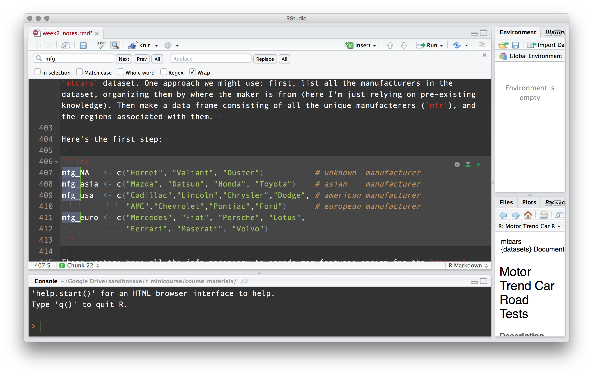
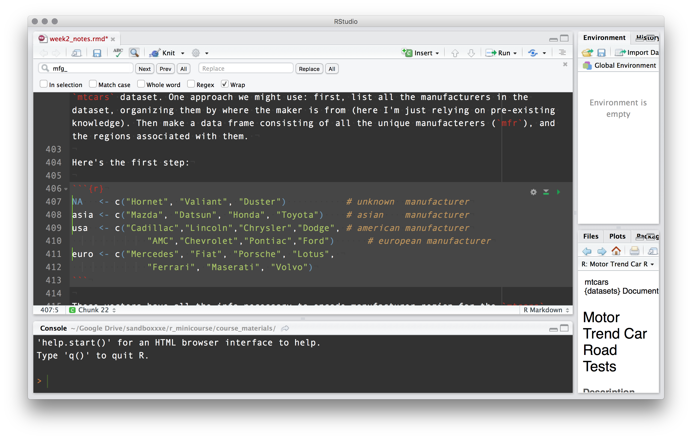
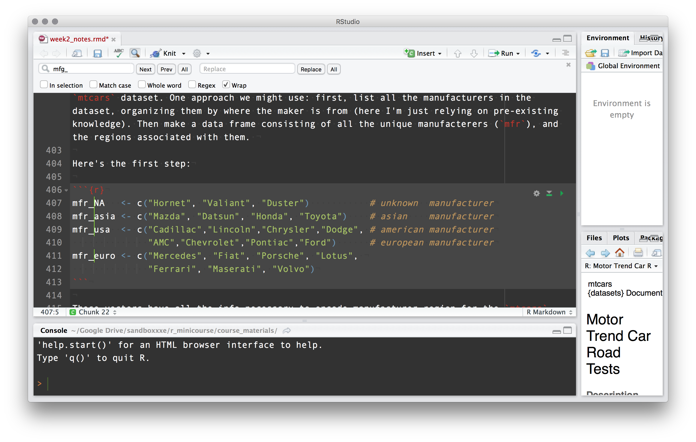

<!-- fig_width: 3 -->
<!--     fig_height: 5 -->
<!-- smaller: true -->

```{r echo=FALSE}
knitr::opts_chunk$set(echo=TRUE)
```


## housekeeping

agenda for the day:

- prep for next week
- week1 exercises
- quick R Studio tips + tricks
- looking at some real datasets
- packages
- reading ("loading/importing") and writing ("saving/exporting") data
- common operations for data cleaning and transformation 
- writing pipe-chains via `magrittr::`'s forward pipe `%>%` (**if time**) 
- writing your own functions (**if time**)

<br><br>

all materials on the course website: 

> [http://lefft.xyz/r_minicourse](http://lefft.xyz/r_minicourse)


## prep for next week


> **for next week: everyone obtain a dataset and send it to me!**

> (see sec 0 of week2 notes for details + some tips)

## week1 exercises


## a couple R Studio tips + tricks

1. multiple cursors in find+replace
2. "import dataset" functionality


## multiple cursors





## multiple cursors





## multiple cursors





## 1. working with real data


## `iris` and `mtcars`


```{r}
head(iris, n=5)
```


```{r}
head(mtcars, n=5)
```

## 

We can just introduce a variable and assign a built-in dataset 
to it:

```{r}
tim_mtcars <- mtcars
```

Let's check out what the columns are:

```{r}
str(tim_mtcars)
```

## `mtcars` column info


- `mtcars$mpg` -- miles per gallon
- `mtcars$cyl` -- number of cylinders
- `mtcars$disp` -- displacement (in$^3$)
- `mtcars$hp` -- gross horsepower
- `mtcars$drat` -- rear axle ratio 
- `mtcars$wt` -- weight (1000lb)
- `mtcars$qsec` -- 1/4 mile time
- `mtcars$vs` -- V/S (V- versus Straight block, I think)
- `mtcars$am` -- automatic or manual transmission
- `mtcars$gear` -- number of gears
- `mtcars$carb` -- number of carburetors

## row names :/


```{r}
rownames(tim_mtcars)
```

since 
`rownames(tim_mtcars)` is a character vector, we can just move it to a column and then delete the rownames.

```{r}
tim_mtcars$make_model <- rownames(tim_mtcars)
rownames(tim_mtcars) <- NULL
```

## missing values

Do we have any missing values?

```{r}
# one way to check would be:
sum(is.na(tim_mtcars$mpg))
sum(is.na(tim_mtcars$cyl))
sum(is.na(tim_mtcars$disp))
# ...
```

## missing values

```{r}
# a quicker way to check:
colSums(is.na(tim_mtcars))

# aaand make sure there aren't NA's that accidentally became characters
# (note "NA" is not the same as NA)
colSums(tim_mtcars=="NA")
```


## 2. a brief but necessary detour: packages!


## 

If you are using a particular package for the first time, you will
have to install it, which is done with `install.packages("<package name>")`
(note quotes around the name). Everyone should install the following packages for the class: 

```{r}
# install.packages("dplyr")
# install.packages("reshape2")
# install.packages("ggplot2")
```


##

After a package is installed, you can "load" it (i.e. make its functions available for use) with `library("<packagename>")`. For this course, we'll use the following packages (maybe more too).

```{r message=FALSE, warning=FALSE, results='hold'}
# don't worry if you get some output here that you don't expect!
# some packages send you messages when you load them. no need for concern. 
library("dplyr")
library("reshape2")
library("ggplot2")
```

##

You can see your **library** -- a list of your installed packages -- by saying
`library()`, *without* an argument. You can see which packages are currently **attached** ("loaded") with `search()`, again with no argument. 

```{r}
# see installed packages (will be different for everyone)
# library()

# see packages available *in current session*
search()
```

**note**: R Studio has lots of point-and-click tools to deal with package 
management and data import. Look at the [R Studio IDE cheatsheet](http://lefft.xyz/r_minicourse/cheatsheets/cheatsheet_rstudio-IDE.pdf) on the course page for details. 


## 3. the outside world (or: reading and writing external files)


## 3.1 read from a url

Here's a cool word-frequency dataset: 

```{r}
# link to url of a word frequency dataset
link <- "http://lefft.xyz/r_minicourse/datasets/top5k-word-frequency-dot-info.csv"
# read in the dataset with defaults (header=TRUE, sep=",")
words <- read.csv(link)
# look at the first few rows
head(words, n=5)
```


## 3.2 read from a local file

Here's a government education dataset I found [here](https://inventory.data.gov/dataset/032e19b4-5a90-41dc-83ff-6e4cd234f565/resource/38625c3d-5388-4c16-a30f-d105432553a4).

```{r}
# i saved it to a local folder, so I can read it in like this
edu_data <- read.csv("datasets/university/postscndryunivsrvy2013dirinfo.csv")
head(edu_data[, 1:10], n=5)
names(edu_data)
```


## 3.3 reading different file types

excel .xls format:

```{r results='markup'}
library("readxl")
# an example of reading xls datasets
crime1 <- read_xls("datasets/crime/Crime2016EXCEL/noncampusarrest131415.xls")
crime2 <- read_xls("datasets/crime/Crime2016EXCEL/noncampuscrime131415.xls")

# see how many rows + columns each one has
dim(crime1); dim(crime2)
```


## 

stata .dta format: 

```{r}
# an example of reading a stata dta file (note we need the haven:: package)
library("haven")
election_data <- read_dta("datasets/election/bes_f2f_original_v3.0.dta")

# notice that objects read from stata maintain some of their 
# idiosyncratic internal structure -- e.g. you can see the survey items 
# "embedded" inside the header fields in the R Studio spreadsheet view 
head(election_data, n=5)
```

##

extracting column info from .dta input:

```{r}
# how many columns are there
numcols <- ncol(election_data)
# create an empty container to catch the column info text
election_data_colinfo <- rep(NA, times=numcols)
# for every number x between 1 and however many columns election_data has:
for (x in 1:numcols){
  # to the x'th element of 
  election_data_colinfo[x] <- attributes(election_data[[x]])$label
}
# now make a df w each row as the name and description of an election_data col
election_dictionary <- data.frame(
  colname  = names(election_data), 
  colinfo  = election_data_colinfo
)
```

## 

we end up with a "data dictionary"

```{r}
# check out the first 20 -- not bad, eh?
head(election_dictionary, n=3)
```


## 3.4 simulating data

If we don't have actual data on a topic but still want to explore it quantitatively, a good option is to use randomly (but systematically) **simulate** some data. 

```{r}
# what's the probability that two of the people here have the same bday?!
# here's one strategy we could use: 
# get a vector of days of the year 
days <- seq(as.Date("2017-01-01"), as.Date("2017-12-31"), "days")
# define a df with 11 people, randomly assigning birthdays
birthday <- data.frame(
  # create 11 "people"
  person = paste0("person_", 1:11),
  # sample from days with replacement to assign birthdays
  bday   = sample(days, size=11, replace=TRUE)
)
# write a statement that'll be true iff two ppl have the same bday
length(unique(birthday$bday)) < nrow(birthday)
```

## more on birthdays

here's a simple simulation, based on the strategy in the previous slide

```{r}
# define some parameters
numsims <- 100
numppl  <- 11
# make a container to hold the simulation results
container <- rep(NA, times=numsims)
# loop over 1,2,...,numsims and generate numppl-many birthdays
for (x in 1:numsims){
  dat <- sample(days, size=numppl, replace=TRUE)
  # for each iteration, assign TRUE to the container element if we have a match
  container[x] <- length(unique(dat)) < length(dat)
}
# now get the proportion of sims where there's a common bday
sum(container==TRUE) / length(container)
```

##

```{r}
# make a quick plot to see the results
ggplot2::qplot(container)
```


## 3.5 cleaning up a dataset and then writing (saving) it

Say we want to introduce info about the region of the manufacturer of each make/model in the `mtcars` dataset. One approach: 

- first, list all the manufacturers in the dataset, organizing them by where the maker is from. 
- second, make a data frame consisting of all the unique manufacterers (`mfr`), and the regions associated with them. 


```{r}
### step 1

mfr_NA   <- c("Hornet", "Valiant", "Duster")           # unknown  manufacturer
mfr_asia <- c("Mazda", "Datsun", "Honda", "Toyota")    # asian    manufacturer
mfr_usa  <- c("Cadillac","Lincoln","Chrysler","Dodge", # american manufacturer
              "AMC","Chevrolet","Pontiac","Ford")      # european manufacturer
mfr_euro <- c("Mercedes", "Fiat", "Porsche", "Lotus", 
              "Ferrari", "Maserati", "Volvo")
```

##


A good way to represent this information would be as a data frame with two columns: one listing the manufacturer, and the other listing the region. 


```{r}
### step 2

# make a data frame assigning regions to car types
car_regions <- data.frame(
  # the mfr_* vectors strung together
  make   = c(mfr_NA, mfr_asia, mfr_usa, mfr_euro), 
  # assign regions to manufacturers, based on the mfr_* vectors and 'make'
  # the idea is to repeat the label for each value in the corresponding vector
  region = c(rep(NA,    length(mfr_NA)),   rep("asia", length(mfr_asia)), 
             rep("usa", length(mfr_usa)),  rep("euro", length(mfr_euro))),
  # since we know we'll be joining this with another df, don't use factors
  stringsAsFactors=FALSE
)

```


## 

```{r}
print(car_regions)
```

now we need to join `car_regions` with `mtcars`...any ideas folks?


## 

let's recode `gear` as a category, instead of a number

```{r}
# make a "lookup table" that associates values of gear with the labels we want 
gear_lookup <- c(three=3, four=4, five=5)

# now combine names(), match(), and [] to recode the values how we want them
mtcars$gear <- names(gear_lookup[match(mtcars$gear, gear_lookup)])
```

**note**: since we manipulated `mtcars`, now it shows up in the environment pane in R Studio :)


##

some realistic data-cleaning operations (**many ways to skin a cat!**)

```{r}
# the variable 'mtcars_clean' will hold the result of piping mtcars
# into the chain mutate() %>% select() %>% rename()
mtcars_clean <- mtcars %>% 
  mutate(
    car       = row.names(mtcars),                        # create 'car' column
    qsec      = round(qsec),                              # round qm time
    mpg       = round(mpg),                               # round mpg
    wt        = wt * 1000,                                # get weight in lbs
    am        = ifelse(am==0, "manual", "auto"),          # code as char
    musclecar = cyl >= 6 & hp > 200 & qsec < 16           # define a muscle car
  ) %>% 
  select(
    car, am, gear, musclecar, cyl, 
    hp, qsec, gear, wt, mpg
  ) %>% 
  rename(
    horsepower=hp, cylinders=cyl, qm_time=qsec, 
    num_gears=gear, lbs=wt, transmission=am
  )
```


##


now the dataset is cleaned up to our liking and now we want to use the cleaned up vesion as our official version of record (or share it with ppl)


```{r}
# write as .csv (the default strategy)
write.csv(mtcars_clean, file="mtcars_clean.csv", row.names=FALSE)

# write as .rda (a compressed R data file -- can include multiple objects)
save(mtcars_clean, file="mtcars_clean.rda")

```

##

you can export to excel format, including multiple sheets

```{r}
# you'll get a message w instructions for installing some suggested packages -- 
# i recommend following them 
library("rio")

# export to sheets of an Excel workbook
export(list(mtcars = mtcars, iris = iris), "multi.xlsx")
```

## 4. 99 problems!

see the notes for discussion of common problems/errors/pitfalls that will 
inevitably arise when you are learning how to read and write datasets from 
different sources and in different formats


## 5. now let's play with some data!

##

here's our cleaned up version of `mtcars`, which we saved as `mtcars_clean.csv`

```{r}
# read it in
dat <- read.csv("mtcars_clean.csv")

knitr::kable(head(dat, 5))
```

## 

now let's manipulate it in a bunch of ways.

<br><br>

what should we do?!

<br><br>

some ideas:

- aggregation  
- subsetting
- grouping vars (dplyr)
- summary statistics
- contingency tables
- diagnostic plots
- modeling...

<!-- endlist -->

<br><br>
<br><br>

[**types into notes file**]


## if time 1: pipe-chains

Most R commands consist of a function applied to one or more arguments (potentially assigning the result to a variable). In the case where there's only one argument, it can be nice to use the forward pipe operator `%>%`. This is part of a family of similar operators defined in the `magrittr::` package, and is made use of heavily in modern `dplyr::` data processing workflows. 

##

It's not as scary as it looks: `x %>% f()` is equivalent to `f(x)`. What's nice about this is that you can make "pipe-chains" when you want to apply a sequence of functions to a single object (`dplyr::`'s functions are designed for exactly this). Forward pipe-chains have the following shape:

> `x %>% f() %>% g() %>% h() %>% z()`

which is equivalent to:

> `z(h(g(f(x))))`


##

assuming we want to save the result of `x` applied to `f()` through `z()`, we can just assign the whole chain to a variable. Here's a little example where given the schema above, `x` is `chars`, and `f()` and `g()` are `unique()` and `length()`. 

```{r}
chars <- sample(letters, size=20, replace=TRUE)

# we could write
numUnique <- length(unique(chars))
numUnique
```

```{r}
# or equivalently:
numUnique <- chars %>% unique() %>% length()
numUnique
```


## if time 2: writing functions


the more you use R, the more things you'll realize you could be doing 
in a way more efficient manner. 

<br>

Learning to write your own functions is a crucial step in learning any programming language, including R.

<br>

##

```{r}
thing1 <- factor(rep(1:3, 5), labels=c("catA", "catB", "catC"))
thing2 <- factor(rep(4:6, 5), labels=c("catA", "catB", "catC"))
thing3 <- factor(rep(3:5, 5), labels=c("catA", "catB", "catC"))
thing4 <- factor(rep(2:4, 5), labels=c("catA", "catB", "catC"))
thing5 <- factor(rep(3:1, 5), labels=c("catA", "catB", "catC"))
```

**question**: how to get all the things coded as character?

## 

one solution:

```{r eval=FALSE}
thing1 <- as.character(thing1)
thing2 <- as.character(thing2)
# ...
```

more compact (in the long run at least!), function-based solution


```{r eval=FALSE}
# a quick function to save us keystrokes
ac <- function(x){as.character(x)}

thing1 <- ac(thing1)
thing2 <- ac(thing2)
# ...
```


##

another example:

```{r}
# saves us even more keystrokes
lu <- function(x){
  length(unique(x))
}

lu(thing1)
length(unique(thing1))
```


##

So what can writing functions do for you? 


```{r}
# define analysis routine
custom_summary <- function(df, group_col, measure_col){
  require("dplyr"); require("ggplot2")
  
  df <- data.frame(group_col=df[[group_col]], measure_col=df[[measure_col]])

  out_table <- df %>% group_by(group_col) %>% summarize(
    avg = mean(measure_col, na.rm=TRUE),
    sd  = sd(measure_col, na.rm=TRUE)     # ... more calculations
  ) %>% data.frame()
  
  out_plot <- ggplot(out_table, aes(x=group_col, y=avg)) +
    geom_bar(stat="identity") +
    geom_errorbar(aes(ymin=avg-sd, ymax=avg+sd, width=.25)) +
    labs(x=group_col, y=paste0("mean of ", measure_col, ", +/- sd"), 
         title=paste0("average ", measure_col, " by ", group_col))
  
  out <- list(table=out_table, plot=out_plot)
  return(out)
}
```

##

We can apply `custom_summary()` to `mtcars` in a number of ways. 
Summarize `mtcars$mpg` for each value of `mtcars$gear` using 
`custom_summary()`, and assign the result to the variable `mpg_by_gear`. 

```{r}
mpg_by_gear <- custom_summary(df=mtcars, group_col="gear", measure_col="mpg")
```

##

```{r}
# print a table
knitr::kable(mpg_by_gear$table)
```

##

```{r}
# display the plot
mpg_by_gear$plot
```

## 

then rinse and repeat on whatever combo of dataset and variables you want!

<br><br><br><br><br><br><br><br>

(some combinations make more sense than others...)

## next week...


- we look through everyone's datasets and discuss any issues that came up
- wide- vs long-format data, reshaping data, the concept of "tidy data"
- visualizing a dataset as a class (type-along)
- visualizing your own dataset with base graphics and `ggplot2::`


<style>
.prettyprint {
  font-size: 18px;
}
.col2 {
 float:left;
}
</style>

