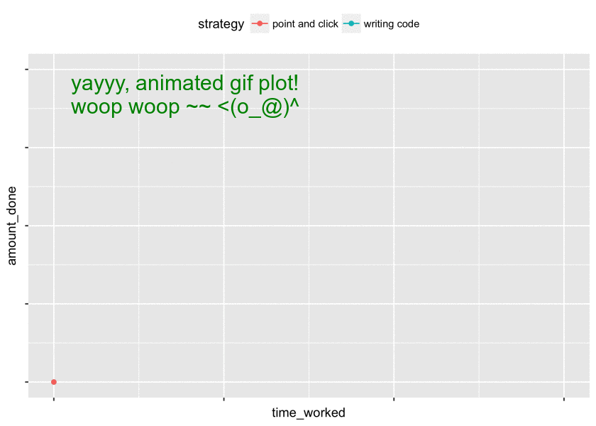

```{r setup, include=FALSE}
knitr::opts_chunk$set(message=FALSE, warning=FALSE, fig.align="center")
```

<hr style="height:2px; background-color: gray; color:gray;">

[FRONT MATTER]

<br><br>

[list of topics for this week from last week's notes]

- ...
- ...


<br>

### 0. [SECTION 0 HEADER]

<hr style="height:1px; background-color:lightgray; color:lightgray;">


```{r notestoself, include=FALSE}
# 1. read in data
#x 2. add "subj_" to `id` and make a factor/char
#x 4. do something with `raceenc1` and `raceenc2`
#x 5. melt over `nat*(y)`'s
#x 6. filter out all NA's from value col
#x 7. delete trailing `y`'s with regex
#x 8. collapse levels of income into "hi", "mid", "lo"


# 9. simple plots w base + qplot
# 10. formula interface for base plotting
# 
# 11. a buncha ggplots!
# 
# 12. how to apply this to your situation

# note: "%in%" <- function(x, table) match(x, table, nomatch = 0) > 0

```


**exercise**: use the commented code in the next chunk to make formatted tables, and compile an R-markdown document to print them nicely :)
```{r}
# to make nicer-looking tables:
# knitr::kable(t(as.table(colSums(is.na(dat)))))
# knitr::kable(table(dat$form), col.names=c("form","count"))
# knitr::kable(table(dat$sex), col.names=c("sex", "count"))
```


##### dk whar this goes 

Question: is it important *for our purposes* to distinguish between "refused" and "no answer" and "does not apply"? I'd say not, since none of them give us data and someone's proclivity for volunteering their race has nothing to do with what we want to measure or explore. Also, it's not even clear that proclivity is that these would indicate...


<br>

### 1. getting the data and defining the problem

<hr style="height:1px; background-color:lightgray; color:lightgray;">

We want to see if the wording of a question has an effect on how people (identified by an `id`) respond to it. The (categorical) grouping variable that determines what kind of wording they got is `form`, which takes the values 1 or 2 (which aren't categorical -- we'll recode them so that they are). 

We have three questions with alternative wordings, which we'd like to investigate (manipulated between-subjects, across the levels of `form`). The questions of interest are:

- `natcity` -- whether ...
    + blah
    + blah
- `natrace` -- whether ...
    + blah
    + blah
- `natfare` -- whether ...
    + blah
    + blah

**important question**: should we be measuring variation across each individual outcome, or can we consider each question an "item" that appears in two conditions (`form==1`, `form==2`)?

Since the `form==2` questions for `nat*(y)` are all longer than their `form==1` counterparts, I'd say it makes sense to consider `form==2` an indication of a variable called *additional description*. Viewed this way, instead of having $n=2867$ observations of three different outcome variables, we would now have $n=2867\times3=8601$  observations of a single outcome variable. 

So what we want to do is to investigate relationships between item responses and other characteristics of the data that responses are "nested" inside of -- which item it is; which wording the respondent got; demographic characteristics of the respondents; etc. 


<br>

### 2. developing a gameplan

<hr style="height:1px; background-color:lightgray; color:lightgray;">

<!-- identifying necessary external information -->
First we'll need to read in the dataset and do some basic cleaning operations to make it easier to work with (e.g. recoding vars that need recoded). After that, we need to map out a gameplan for getting the data in the format we want it in. 

Here's the gameplan that came to my mind.

To investigate the impact of wording, item, etc. on responses, we'll need to have our outcome variable `response` as a single column of the dataset. But there's a problem: the outcome is spread across six columns...What'd be nice would be to have it instead as two columns: one indicating the question (i.e. `natcity` or `natrace` or `natfare`), and one indicating the response (i.e. `0`, `1`, `2`, `3`, `8`, or `9`). Since we already checked that `form` encodes wording type, we can safely just remove the `y` suffixes from the columns of interest. 

So how do we arrive at our target format? 

There are many ways. Here's a natural one to implement: 

1. expand each row into six separate rows of `ncol(dat16) - 6 + 2` columns apiece, where the final six columns are deleted and replaced by two new columns `item` and `response` such that for each set of six rows `i:(i+5)` (all of whose values in columns `1:(ncol(dat16)-6)` are identical to the original value in the unexpanded row `i`): 
<!-- from which they were generated): -->
    + `dat16$item[i:(i+5)]` is the length-six character vector consisting of the names of the columns we're chopping off (i.e. `c("natcity","natcityy","natrace","natracey","natfare","natfarey")`); and 
    + `dat16$response[i:(i+5)]` contains the value of the chopped-off column with the name `dat16$item` specifies for that row.

2. delete all rows $i$ for which `dat16$value[i] %in% c(0,9)` (OR WE USE `NA` ALREADY?!), since: 
    + half of all the rows we generated in step 1. will have value `0`, since they didn't provide an answer to the corresponding `dat16$item` -- these aren't real data points; and
    + we can't use the "no answers," for present purposes they are dead to us.

Notice that now we've erased all the empty values, what we're left with is a dataset where `dat16$item` has one set of values for one level of `form`, and another set of distinct but corresponding values for the other level of `form`. But conceptually, the situation is that there's only three values of `dat16$item` -- not six -- and that `dat16$item` form tells us what kind of wording a particular subject got for the three items. This justifies identifying `*y` values in `dat16$item` with their corresponding `*` values. In other words, 

3. we delete all the trailing `y`'s from the `dat16$item` column. 


**note**: we shouldn't just delete all `y`'s, since `"natcityy"` has one that we don't want to chop off! 

**exercise**: how would you chop off all `"y"`'s from the column? 

**exercise**: what if anything could or would go wrong if we just chopped off all the `"y"`'s?

Now our data is (are?!) *fucking beautiful* and we're ready to start exploring it (although in the colloquial sense I'd say we've already explored it quite a bit!).

**note**: the steps we took above were motivated not just by intuition, but also by the concept of "tidy data," championed by Hadley Wickham et al. If you're interested, I'd **highly** recommend reading [this excellent paper](LINK), which is kind of a manifesto for a certain kind of "tidiness" through all phases of a data-related endeavor. 


We also want to see if demographic variables modulate the effect of wording on response. The demographic variables we have are: 

- `sex`
- `age`

These are all pretty self explanatory as far as what they represent goes, but other than `age` we don't really know the correspondence between the numeric codes and the real-world values they represent. To make the correspondence visible, we'll recode each of them to values we can look at and immediately understand.


<br>

### 3. reading and cleaning and transforming the data

<hr style="height:1px; background-color:lightgray; color:lightgray;">


#### 3.1 read in data and inspect

```{r}
# read in the data and do some initial inspection
dat <- read.csv("datasets/gss_2016_test.csv") 

# check for na's (none, yay!...but are there *really* none?!)
colSums(is.na(dat))

str(dat)
head(dat, n=5)
```


#### 3.2 basic cleanup and recoding

```{r}
# now check + clean up + transform columns as necessary

# `id` is an identifier, not a number
dat$id <- paste0("resp", dat$id)

# `form` has just two levels
table(dat$form)

# so we can recode it with `ifelse()`
dat$form <- ifelse(dat$form==1, "standard", "alternate_y")

# `sex` has just two levels
table(dat$sex)

# so we can recode it with `ifelse()`
dat$sex <- ifelse(dat$sex==1, "male", "female")

# income has lots of different values
# ALSO BTW YAY FIRST PLOT! 
barplot(table(dat$INCOME16))

# so we'll have to recode it in a more mechanical fashion...

# one option:
# recode income to `hi` or `mid` or `lo`, according to external values
lo  <- 1:12; mid <- 13:21; hi  <- 22:26
dat$income_cat <- ifelse(
  dat$INCOME16 %in% lo, "lo", ifelse(
    dat$INCOME16 %in% mid, "mid", ifelse(
      dat$INCOME16 %in% hi, "hi", NA
    )
  )
); rm(lo); rm(mid); rm(hi)

# another option:
# read in external vals as a table, and just sub in values for numeric codes
income <- read.csv(
  "datasets/lookup_income.csv", header=FALSE, col.names=c("num","val"), 
  stringsAsFactors=FALSE
)
# make a vector with values equal to income$val, and names income$num
income_lkup        <- as.vector(income$val)
names(income_lkup) <- income$num

# recode the income column by matching vals w the lookup table names
dat$income_range <- income_lkup[match(dat$INCOME16, names(income_lkup))]

# remove the original income col
dat$INCOME16 <- NULL
```


#### 3.3 a slightly more complicated case

```{r}
# let's check out the race cols again
table(dat$racecen1, useNA="always")
table(dat$racecen2, useNA="always")

# kinda messy...let's just extract the census's notion of "ethnicity"
# (i.e. hispanic or non-hispanic)

# first read in our associative array of keys and values
race <- read.csv(
  "datasets/lookup_race.csv", header=FALSE, col.names=c("num","val"),
  stringsAsFactors=FALSE
)
race_lkup        <- as.vector(race$val)
names(race_lkup) <- race$num

dat$racecen1 <- ifelse(dat$racecen1 %in% c(0,98,99), NA, dat$racecen1)
dat$racecen2 <- ifelse(dat$racecen2 %in% c(0,98,99), NA, dat$racecen2)

dat$racecen1 <- race_lkup[match(dat$racecen1, names(race_lkup))]
dat$racecen2 <- race_lkup[match(dat$racecen2, names(race_lkup))]

dat$hisp <- ifelse(
  dat$racecen1=="Hispanic", "hispanic", "nonhispanic"
)
dat$hisp[dat$racecen2=="Hispanic"] <- "hispanic"

# now we can safely eliminate the `racecen1/2` columns
dat$racecen1 <- NULL; dat$racecen2 <- NULL
```

#### 3.4 reorganize columns as desired, toss unused ones

```{r}
# now we have everything except the outcome vars
# reorganize the df the way we want it
dem_cols  <- c("id", "year", "form", "sex", "age", "income_cat", "hisp")
item_cols <- names(dat)[startsWith(names(dat), "nat")]
dat <- dat[, c(dem_cols, item_cols)]
```


#### 3.5 deriving the outcome variable with `reshape2::melt()`

Now we'll implement our strategy for representing the responses summarized in section 2 above (steps 1-3). This involves a process called "melting" the dataset. The result is moving from the current "wide format" to a "long format" dataset. 

The terminology should become more clear as you see more instances of this (very common) transformation. 

```{r}
# NATFARE/NATFAREY/NATCITY/NATCITYY/NATRACE/NATRACEY
#    9        "No answer"
#    8        "Don't know"
#    3        "Too much"
#    2        "About right"
#    1        "Too little"
#    0        "Not applicable"

library("reshape2")
dat <- melt(dat, id.vars=dem_cols)
dat$variable <- as.character(dat$variable)
names(dat)[names(dat)=="variable"] <- "item"
names(dat)[names(dat)=="value"]    <- "response"

# let's check out what we have now:
knitr::kable(head(dat, n=10))
```

**exercise**: how does the line of code renaming `variable` to `item` work? Now try the command `"item" -> names(dat)[names(dat)=="variable"]`. What is the symbol `->` and how is it related to `<-`?

```{r}
# toss all the rows w/o real answers
dat <- dat[!dat$response %in% c(9, 8, 0), ]

# make a lookup table for the responses
val_lkup <- c(`1`="too little", `2`="about right", `3`="too much")

# recode responses as character
dat$response <- as.character(val_lkup[match(dat$response, names(val_lkup))])

# look at a table
knitr::kable(table(dat$response, useNA="ifany"), col.names=c("resp", "freq"), pad=0)
```

Recall point 3. in our gameplan above -- we want just 3 unique vals in `item`. But currently we have six:

```{r}
knitr::kable(table(dat$item, useNA="ifany"), col.names=c("item", "freq"), pad=0)
```

A simple -- albeit kind of sloppy -- solution would be to just remove all occurrences of the letter "y" from the `item` column. Let's just do that (see exercise though):

```{r}
# for now we'll just toss all y's to make life easier
dat$item <- gsub("y", "", dat$item)

# confirm that we have just three vals now
knitr::kable(table(dat$item, useNA="ifany"), col.names=c("item", "freq"), pad=0)
```

**exercise (important)**: Remove all trailing `"y"`'s from the `dat$response` column. (*hint*: use the regular expressions cheatsheet on the course page)

<br>


### 4. summarizing and plotting the data

<hr style="height:1px; background-color:lightgray; color:lightgray;">


#### 4.1 summarizing data with a variety of methods

Here's a variety of ways we can summarize the data, using a few different strategies. 

```{r}
# many ways to summarize data by groups!

# frequency tables
table(dat$sex, dat$response)
table(dat$income_cat, dat$response)

# tables can have arbitrary dimensions, but even three is tough to parse...
# table(dat$sex, dat$income_cat, dat$response)

# cross-tabulate 
xtabs( ~ sex + income_cat, data=dat)
xtabs( ~ response + sex + income_cat, data=dat)

# marginal proportions
# **exercise** try setting margin=2
prop.table(xtabs( ~ response + income_cat, data=dat), margin=1)
prop.table(table(dat$response, dat$income_cat), margin=1)

# dplyr::summarize()/group_by() is my drug of choice:
library("dplyr")
dat %>% group_by(sex, income_cat) %>% summarize(
  num_obs = length(response),
  num_toolittle = sum(response=="too little", na.rm=TRUE),
  prop_toolittle  = num_toolittle / num_obs,
  num_aboutright = sum(response=="about right", na.rm=TRUE),
  prop_aboutright = num_aboutright / num_obs,
  num_toomuch = sum(response=="too much", na.rm=TRUE),
  prop_toomuch = num_toomuch / num_obs
  # the `mutate_if()` is just to make it display nicer
) %>% mutate_if(is.numeric, round, digits=3) %>% data.frame()

dat %>% group_by(item, form) %>% summarize(
  num_obs = length(response),
  num_toolittle = sum(response=="too little", na.rm=TRUE),
  prop_toolittle  = num_toolittle / num_obs,
  num_aboutright = sum(response=="about right", na.rm=TRUE),
  prop_aboutright = num_aboutright / num_obs,
  num_toomuch = sum(response=="too much", na.rm=TRUE),
  prop_toomuch = num_toomuch / num_obs
) %>% mutate_if(is.numeric, round, digits=3) %>% data.frame()


# can use formula interface with `aggregate()`
aggregate(age ~ sex + income_cat, FUN="mean", data=dat)
aggregate(age ~ sex + income_cat, FUN="sd", data=dat)
aggregate(age ~ sex + income_cat, FUN=function(x) round(mean(x)), data=dat)

# write a custom function for aggregating
custom_summary <- function(x){
  c(mean=round(mean(x)), sd=round(sd(x)), min=min(x), max=max(x))
}
aggregate(age ~ sex + income_cat, FUN=custom_summary, data=dat)
```


**exercise**: what does the following command yield, and why does it yield that? Does this make sense as a summary for some combination of our variables? 
command: `xtabs(age ~ sex + income_cat, data=dat)`

**note**: you'll see the *formula* interface used in `xtabs()` in a few different areas in R -- most notably in regression modeling. The form is usually `y ~ x1 + ... + xn`, with `y` being the outcome variable and the `xi`'s being predictors. 


Now let's get to plotting folks!!!


#### 4.2 plotting with base functions

There are several base functions for making plots. They're great for exploratory analysis because they're so quick and easy. They can be customized endlessly, but if you want to customize the appearance, you're better off using `ggplot()`.

```{r}
# barplots made from a table
barplot(table(dat$sex))
barplot(table(dat$income_cat))
```


```{r}
# basic scatterplot
plot(iris$Sepal.Width, iris$Sepal.Length)
# with color coding
plot(iris$Sepal.Width, iris$Sepal.Length, col=iris$Species)
```

```{r}
xvar <- 1:10
yvar <- rnorm(xvar)
# line plot (nice for time-series)
plot(xvar, yvar, type="l")
# scatter
plot(xvar, yvar, type="p")
# both
plot(xvar, yvar, type="b")
# other options are "c", "o", "S"/"s", "h", "n"
```

```{r}
# histograms for numeric univariate distributions
# this is probably the base plotting function i use the most
hist(dat$age)
```

**exercise**: merge the 2012, 2014, and 2016 data using a `*_join()` operation from `dplyr::` (see the top-right of the second page of the data wrangling cheatsheet). Then make a line-plot where the x-axis is `year`, and the y-axis is proportion "too much" responses across all three items.


#### 4.3 plotting with `ggplot2::`

Alright, bringing out the big guns now. `ggplot2::` has its own syntax, because you interact with its plotting capabilities via a **domain-specific language** (DSL), which you can think of as kind of a mini-language that's very limited in scope because it's only meant to do one thing. For example the formula interface we saw with `aggregate()` can be considered a DSL. 

Before plotting, we'll make a couple of summary datasets, which will make some aspects easier moving forward.

```{r}
pdat <- dat %>% group_by(sex, income_cat, item, form) %>% summarize(
  num_obs = length(response),
  mean_age = mean(age, na.rm=TRUE),
  prop_toolittle  = sum(response=="too little", na.rm=TRUE) / num_obs,
  prop_aboutright = sum(response=="about right", na.rm=TRUE) / num_obs,
  prop_toomuch = sum(response=="too much", na.rm=TRUE) / num_obs
) %>% mutate_if(is.numeric, round, digits=3) %>% 
  melt(measure.vars=c("prop_toolittle","prop_aboutright","prop_toomuch")) %>% 
  data.frame()

# make sure income is ordered how we want it (the others dont matter)
pdat$income_cat <- factor(pdat$income_cat, levels=c("lo","mid","hi"))

```


The best way to learn ggplot is by example, so here we go.


```{r}
library("ggplot2")

# scatterplots

# regular
ggplot(pdat, aes(x=mean_age, y=value)) +
  geom_point()

# color-coded
ggplot(pdat, aes(x=mean_age, y=value, color=variable)) +
  geom_point()

ggplot(pdat, aes(x=mean_age, y=value, color=income_cat)) +
  geom_point()

# size-coded
ggplot(pdat, aes(x=mean_age, y=value, size=num_obs)) + 
  geom_point()

# size- and color-coded
ggplot(pdat, aes(x=mean_age, y=value, size=num_obs, color=income_cat)) + 
  geom_point()
```

**exercise**: how could we get rid of the `NA`'s in the plot with color coding for `income_cat`?


Now let's look at how the responses are distributed for individual items:

```{r}
# first group the data by item and get proportions for each response
boosh <- dat %>% group_by(item) %>% summarize(
  prop_toolittle  = sum(response=="too little", na.rm=TRUE) / n(),
  prop_aboutright = sum(response=="about right", na.rm=TRUE) / n(),
  prop_toomuch = sum(response=="too much", na.rm=TRUE) / n()
) %>% melt(id.vars="item")

# now make some plots
ggplot(boosh, aes(x=item, y=value, fill=variable)) + geom_bar(stat="identity")

ggplot(boosh, aes(x=item, y=value, fill=variable)) +
  geom_bar(stat="identity", position="dodge") 

ggplot(boosh, aes(x="", y=value, fill=variable)) +
  geom_bar(stat="identity", position="dodge") +
  facet_wrap(~item)
```


Now let's see if `form` looks like it has an effect on responses!

```{r}
# first group the data by item and get proportions for each response
boosh <- dat %>% group_by(item, form) %>% summarize(
  prop_toolittle  = sum(response=="too little", na.rm=TRUE) / n(),
  prop_aboutright = sum(response=="about right", na.rm=TRUE) / n(),
  prop_toomuch = sum(response=="too much", na.rm=TRUE) / n()
) %>% melt(id.vars=c("item","form")) %>% data.frame()

knitr::kable(boosh)
```


We can plot this in a number of ways -- each providing a slightly different perspective on the data. (generally speaking, *not* all perspectives are equally useful/sensical!)

```{r}
ggplot(boosh, aes(x=variable, y=value, fill=form)) + 
  geom_bar(stat="identity", position="dodge") +
  facet_wrap(~item) 

ggplot(boosh, aes(x=item, y=value, fill=form)) + 
  geom_bar(stat="identity", position="dodge") +
  facet_wrap(~variable) 


ggplot(boosh, aes(x=variable, y=value)) +
  geom_bar(stat="identity", position="dodge") +
  facet_grid(item ~ form) 

ggplot(boosh, aes(x=variable, y=value, fill=variable)) +
  geom_bar(stat="identity", position="dodge") +
  facet_grid(item~form) 


```

**exercise**: what should we expect `sum(boosh$value)` to evaluate to? Why?


#### 4.4 styling and saving plots!

Okay, here's the fun part. Here's a few of the things we went over in class:


```{r}
# control the color coding

# move the legend position

# label the axes and plot

# add a caption

# add labels for the values

# axis limits and axis ticks

# ...
```

Two basic ways to save a `ggplot2::` plot object are:

1. via the "export" interface in R Studio
2. via the function `ggsave()`

You can specify the dimensions and filetype etc. with the "export" interface. You can do the same with `ggsave()`, *but* the latter has a few advantages: 

- if you save a plot with a command instead of point-and-click, you'll never forget what size you saved it as! That way, if you need to update the figure, you can just re-run the code. 
- you can save a bunch of plots automatically as a by-product of just running your script.
- you can do fun stuff like the animation in the appendix :p


<br>

### next week {#nextweek}

<hr style="height:1px; background-color:lightgray; color:lightgray;">


- document authoring with R Markdown
    + everyone will create one quick R Markdown document together
    + then everyone will create their own with their own dataset!

<br>

### appendix 1: analyzing the data with statistical models  {#appendix}

<hr style="height:1px; background-color:lightgray; color:lightgray;">


```{r}
# [APPENDIX CONTENT]
```

<br>

### appendix 2: the power of pipe-chains for data cleaning

<hr style="height:1px; background-color:lightgray; color:lightgray;">

if you don't think the word "power" quite applies here, try "concise", "clean", "pretty", "uniform", "simple", etc.

```{r}
library("dplyr")
dat16 <- read.csv("datasets/gss_2016_test.csv") %>% mutate(
  id = paste0("resp_", id),
  form = ifelse(form==1, "standard", "alternate_y"),
  sex = ifelse(sex==1, "male", "female")
)

```

<br>

### appendix 3: using `for`-loops to make animated gif plots!

<hr style="height:1px; background-color:lightgray; color:lightgray;">

Title is hopefully self-explanatory! Check out the super fun + cool `magick::` package (esp. [this nice vignette](https://cran.r-project.org/web/packages/magick/vignettes/intro.html)), which allows you to call image-magick functions directly from R. 

**exercise**: mark up the code below with comments explaining what's happening in each step or line of code, and why. (places where I'd suggest putting comments are marked with `# [comment here]` -- writing lots of comments is a good way to reinforce stuff in your memory)

```{r eval=FALSE}
library("ggplot2")
library("magick")

# [comment here]
df <- data.frame(
  time_worked = rep(seq(0, 1.4, .2), times=2),
  amount_done = c(seq(0, 4, .8)^2, 50, 100, seq(0, 9, 2)^2, 85, 90, 95),
  strategy    = rep(c("writing code", "point and click"), each=8)
)
# [comment here]
df <- arrange(df, time_worked)

# [comment here]
for (x in seq(from=2, to=nrow(df), by=2)){
  # [comment here]
  myplot <- 
    ggplot(df[1:x, ], aes(x=time_worked, y=amount_done, color=strategy)) + 
    # [comment here]
    geom_point() + 
    # [comment here]
    geom_line() +
    # [comment here]
    scale_x_continuous(limits=c(0, 1.5)) +
    scale_y_continuous(limits=c(0, 100)) +
    # [commment here]
    theme(legend.position="top", 
          axis.text=element_blank())
  
  # [comment here]
  fname_digit <- ifelse(x < 10, paste0("0", x), as.character(x))
  
  # [comment here]
  ggsave(
    filename=paste0("plots/myplot", fname_digit, ".png"), plot=myplot, 
    width=7, height=5, units="in"
  )
  
}

# [comment here]
gifcap <- c("yayyy, animated gif plot! \nwoop woop ~~ <(o_@)^")

# [comment here]
dir("plots/")[endsWith(dir("plots/"), ".png")] %>% 
  (function(x) paste0("plots/", x)) %>% 
  # [comment here]
  image_read() %>% 
  image_scale("x600") %>% 
  # [comment here]
  image_join() %>%
  image_animate(fps=2) %>% 
  # [comment here]
  image_annotate(gifcap, location="+100+100", color="green", size=30) %>% 
  # [comment here]
  image_write(path="output/animate_woop_woop.gif", quality=10)

```

Aaaand here's what we end up with:




<hr><hr>
<br><br>


<link rel="stylesheet" type="text/css"
href="https://fonts.googleapis.com/css?family=Open+Sans:300,400,400i,700">

<link href="https://fonts.googleapis.com/css?family=Roboto+Mono:300,400,500" rel="stylesheet">

  <style>
body {
  padding: 10px;
  font-size: 12pt;
  font-family: 'Open Sans', sans-serif;
}

h1 { 
  font-size: 20px;
  color: DarkGreen;
  font-weight: bold;
}

h2 { 
    font-size: 16px;
    color: green;
}

h3 { 
  font-size: 24px;
  color: green;
  font-weight: bold;
}

h4 { 
  font-size: 18px;
  color: green;
  font-weight: bolder;
  padding-top: 30px;
}

.table {
  width: 75%;
}

li {
  padding: 3px;
}

code {
  font-family: 'Roboto Mono', monospace;
  font-size: 14px;
}

pre {
  font-family: 'Roboto Mono', monospace;
  font-size: 14px;
}

p {
  margin-top: 30px;
  margin-bottom: 15px;
}

</style>


<!-- END OF DOCUMENT IS HERE -->

