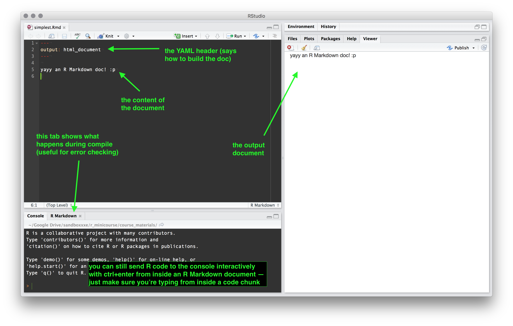
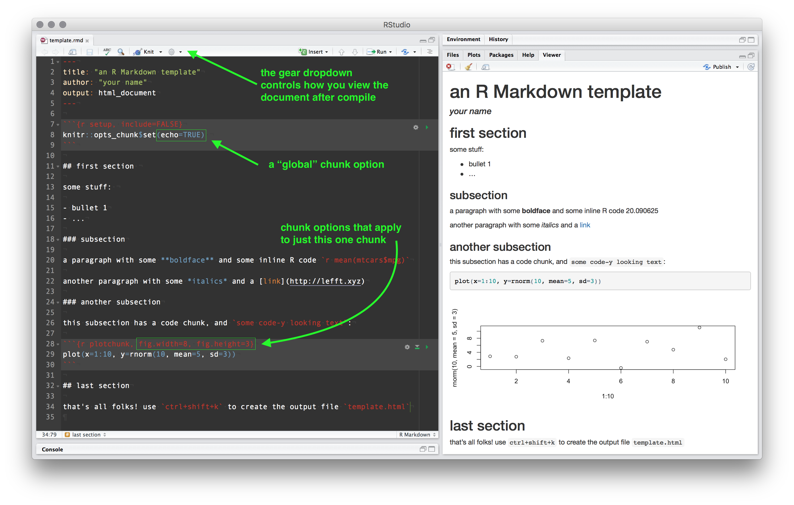

```{r setup, include=FALSE}
knitr::opts_chunk$set(results="hold")
```

<hr style="height:2px; background-color: gray; color:gray;">

Here's the agenda for today:

1. [markdown and R Markdown basics](#sec1)
    - 1.1 [what is "markdown" and what is "R markdown"?!](#sec11)
    - 1.2 [structure of an R markdown document](#sec12)
    - 1.3 [output formats](#sec13)
    - 1.4 ["quick report" from an R script](#sec14)

2. [producing some R Markdown documents](#sec2)
    - 2.1 [quick example documents](#sec21)
    - 2.2 [working through an example together](#sec22)
    - 2.3 [everyone builds their own nice pretty document!](#sec23)

3. [concluding...](#sec3)
    - ...and happy-houring?! I'm thinking of going to [Jimmy's/Woodlawn Tap](https://goo.gl/maps/oD9JLEWPvv62) -- any takers??


<br><br>

### 1. markdown and R Markdown basics {#sec1}

<hr style="height:1px; background-color:lightgray; color:lightgray;">


#### 1.1 what is markdown and what is *R* markdown?! {#sec11}

**Markdown** is a format for writing in plain text. There are many "flavors" of markdown, but they're all fairly similar. For example there's wordpress-flavored markdown, wikipedia-flavored markdown, and stack overflow-flavored markdown. There's also something like "R-flavored markdown", which is typed directly into a plain-text document with extension `.Rmd` (like this one). 


Markdown documents usually end up getting **compiled** by some system or another. Basically what the compiler does is it takes your plain text document and builds a fancy version of it: the "compiled"/"output" version has the same content but is now a different kind of document -- like .docx or .pdf or .html -- and has whatever kind of style/formatting you'd expect for that kind of document. 


When you're actually writing, special formatting makes the structure of the document visible (e.g. with ###'s for section headings). And when you actually compile the document, those same structural components will still be there -- they'll just be prettified and adapted to whatever the output format it (e.g. html, pdf, or docx). 


The point of markdown is that it's simultaneously easy for humans to use and easy for computers to understand. Writing in markdown is much, much simpler than writing in e.g. Microsoft Word or $\LaTeX$. There's no dropdowns and no options or commands relating to indentation, fonts, etc.: you're just typing whatever you want to type into a text editor. All the formatting is done *externally*, e.g. by some css rules that you have somewhere else, or by the engine that's making your output document (which will be [knitr](https://yihui.name/knitr/) in our case). 


**note**: key to markdown is the idea that content is specified separate from style. This principle also drives the internet, and (I'd say) is directly reflected in the recent move away from older html protocols and towards the complete integration of HTML5 and CSS. 


#### 1.2 structure of an R markdown source document (`.rmd` file) {#sec12}

+ header ("YAML header")
+ text 
    - just normal text, in markdown format 
    - any html you want to add (*optional*)
+ code chunks
    - the setup chunk (specify defaults)
    - all other chunks (show code and/or output)
+ inline R code
    - to evaluate and format as text: `r cat("\x60r ... \x60")`
    - to display as code: `r cat("\x60 ... \x60")`
+ html/css (*optional*) 


#### 1.3 output formats you can create from `.rmd` files {#sec13}

- html document
- pdf document (via $\LaTeX$)
- MS Word document
- slides (various output options, but beyond scope of course)
- "flexdashboards" (beyond scope of course)
- Shiny apps (beyond scope of course)


#### 1.4 making a "quick report" from an R script {#sec14}

You can use the shortcut **`ctrl+shift+k`** to build an output document, even on a normal R script. This will cause knitr to build a "quick report" -- basically, a visually nice version of your R script. 


<br>

### 2. producing some R Markdown documents {#sec2}

<hr style="height:1px; background-color:lightgray; color:lightgray;">

#### 2.1 quick example documents {#sec21}

##### the simplest one

Here's the simplest R Markdown file that one could make, alongside its output:



It's just a plain text file with a few weird lines at the top. But notice that on the right is what you get when you use `knitr::` on it (R Studio shortcut: **`cmd+shift+k`**). The output file has the same content as the source file, but it's in a viewer-friendly format. 

##### a more useful one

Here's an example of an R Markdown file with some more useful stuff in it, also  alongside its output:



The file itself is only 35 lines, but it illustrates a lot of useful things. See also the default R Studio `.Rmd` template, which you can view by going to "File" --> "New File" --> "R Markdown..." and then selecting your output format of choice. 


#### 2.2 working through an example together {#sec22}

**exercise**: go through the file `template.rmd` line-by-line, and compare it to the output file `template.html` to get an idea of how different kinds of things get rendered. 

**exercise**: do the same for `week4_skeleton.rmd`, comparing it to `week4_skeleton.html` 


#### 2.3 everyone builds a nice pretty document!  {#sec23}

Now here's the task, which simultaneously functions as an in-class activity, as the exercises for the fourth and final week, and as a "final project": 

**exercise**: using `week4_skeleton.rmd` as a starting point, create an R Markdown document that...

1. reads in the dataset you obtained last week; 
2. prints the first few rows of the dataset (try wrapping with `knitr::kable()` for nicer output); 
3. prints some summary statistics and/or tables of a few columns of interest (whatever feels most do-able and comfortable -- maybe some `table()`s or an `aggregate()`; or, use `group_by()` and `summarize()` from `dplyr::` if you want to get fancy); 
4. displays a plot using one of the base functions `plot()`, `barplot()`, or `hist()`; and
5. displays a plot using `ggplot()`, or using the `qplot()` function from `ggplot2::` (a nice quick way to visualize info -- forgot to touch on that last week!)

If you can make a document with all of these components, then you have learned quite a lot. If you can make such a document *and understand how everything works*, then...you've learned quite a lot plus even more.  

<br>

### 3. concluding remarks {#sec3}

<hr style="height:1px; background-color:lightgray; color:lightgray;">

Anyway, final thought: 

> **PRACTICE MAKES PERFECT**$^***$

$^***$ I mean of course nothing is ever *perfect*. But I do think that practice is both a necessary and a sufficient condition for becoming proficient. 

<br>

If you put the hours in, you will be rewarded more than you might expect. With all the resources the internet has to offer, it is totally possible to become a proficient R user with a year or less of consistent practice. 

*Most importantly of all*, try to stay calm when you get stuck. And you will get stuck. Many times. Getting stuck is perfectly fine and perfectly normal. No one learning to code *doesn't* get stuck many, many times. Use google, and use it often. Use stack overflow, and use it often. If you get sidetracked when googling one thing and find yourself reading about some other R-related thing, *that is actually a good thing*. The more you expose yourself to *anything* R-related, the faster you'll learn. 

On the course page there's a list of [interesting links](http://lefft.xyz/r_minicourse/index.html#linxe) that I've been gathering the last few weeks. Some of them are as entertaining as they are instructive, so check them out if you want to.


Okay that's it. Happy hacking yalls!


<hr><hr>
<br><br>


<link rel="stylesheet" type="text/css"
href="https://fonts.googleapis.com/css?family=Open+Sans:300,400,400i,700">

<link href="https://fonts.googleapis.com/css?family=Roboto+Mono:300,400,500" rel="stylesheet">

  <style>
body {
  padding: 10px;
  font-size: 12pt;
  font-family: 'Open Sans', sans-serif;
}

h1 { 
  font-size: 20px;
  color: DarkGreen;
  font-weight: bold;
}

h5 { 
    font-size: 16px;
    color: green;
}

h3 { 
  font-size: 24px;
  color: green;
  font-weight: bold;
}

h4 { 
  font-size: 18px;
  color: green;
  font-weight: bolder;
  padding-top: 30px;
}

.table {
  width: 75%;
}

li {
  padding: 3px;
}

code {
  font-family: 'Roboto Mono', monospace;
  font-size: 14px;
}

blockquote {
  font-style: italic;
}

pre {
  font-family: 'Roboto Mono', monospace;
  font-size: 14px;
}

p {
  margin-top: 30px;
  margin-bottom: 15px;
}

</style>


<!-- END OF DOCUMENT IS HERE -->

