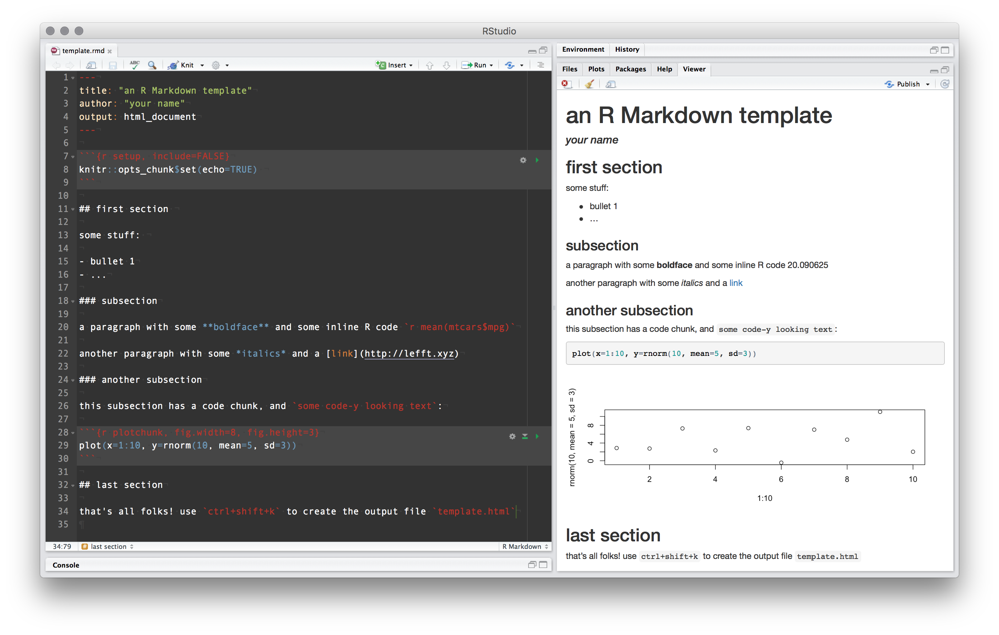

```{r echo=FALSE}
knitr::opts_chunk$set(echo=TRUE)
```


## agenda for the day

1. markdown and R Markdown basics
    - wha is "markdown" and wha is "R markdown"?!
    - structure of an R markdown document
    - output formats

2. producing some R Markdown documents
    - planning the flow of an "analysis document"
    - working through a quick example document together
    - everyone builds a nice pretty document! 

3. drinking
    - thinking of going to Jimmy's aka Woodlawn Tap -- any takers?!


**all materials on the course website:**

> [http://lefft.xyz/r_minicourse](http://lefft.xyz/r_minicourse)


## 1. markdown and R Markdown basics

### wha is markdown and wha is *R* markdown?!

### structure of an R markdown document

### output formats

## 2. producing some R Markdown documents

### planning the flow of an "analysis document"

### working through a quick example document together

### everyone builds a nice pretty document! 

## 3. drinking

thinking of going to Jimmy's aka Woodlawn Tap -- any takers?!


## structure of an R markdown document

+ header ("YAML header")
+ text 
    - just normal text, in markdown format 
    - any html you want to add (*optional*)
+ code chunks
    - the setup chunk (specify defaults)
    - all other chunks (show code and/or output)
+ inline R code
    - to evaluate and format as text: `r cat("\x60r ... \x60")`
    - to display as code: `r cat("\x60 ... \x60")`
+ css (*optional*) <!-- , as html or external style file -->


## output formats for `.rmd` documents

- html document
- pdf document
- MS Word document
- slides (various output options)


## 

an example document




## 

now everyone build their own!

here's a template to get you started:

        http://lefft.xyz/r_minicourse/week4_materials/simple_template.rmd

and here's the `.rmd` source for the week 4 notes:

        http://lefft.xyz/r_minicourse/week4_materials/fancy_norc_template.rmd


## 

ideas for things to include in document:

- remember to load your packages!
- read in your dataset and print a summary or the `head()`/`tail()`
- tables for a few variables, with or without `kable()` 
- scatterplots or barplots or histograms with `plot(x, y)`, `barplot(table(df$x)))`, and `hist(df$x)`
- fancy visualizations with `ggplot()`
- ggplotly exx
- you can't use current vars in an rmd -- must be "modular"


<style>
.prettyprint {
  font-size: 18px;
}
.col2 {
 float:left;
}
</style>

